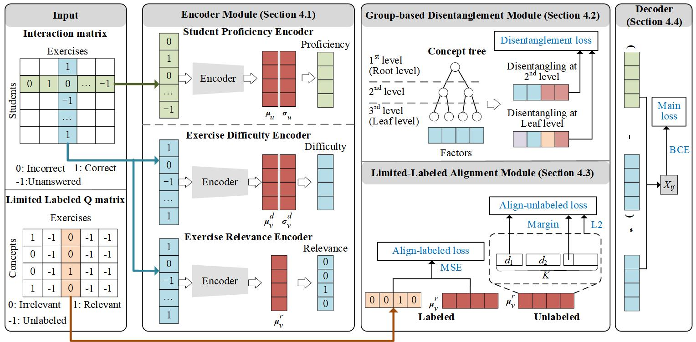

<div align="center">

# [NeurIPS 2023] Disentangling Cognitive Diagnosis with Limited Exercise Labels
<p>


</p>
<p>
Official implementation of "Disentangling Cognitive Diagnosis with Limited Exercise Labels", NeurIPS 2023.
</p>


</div>

In this paper, we propose the Disentanglement based Cognitive Diagnosis (DCD) model to address the challenge of limited exercise labels in cognitive diagnosis. Specifically, we utilize students’ response records to model student proficiency, exercise difficulty and exercise label distribution. Then, we introduce two novel modules - group-based disentanglement and limited-labeled alignment modules - to disentangle the factors relevant to concepts and align them with real limited labels. Particularly, we introduce the tree-like structure of concepts with negligible cost for group-based disentangling, as concepts of different levels exhibit different independence relationships. Extensive experiments on widely used benchmarks demonstrate the superiority of our proposed model.

## Install

The current implementation is based on [EduStudio](https://edustudio.ai) library that is a Unified and Templatized Framework for Student Assessment Models including Cognitive Diagnosis(CD) and Knowledge Tracing(KT).

1. Install `pytorch==1.12.1` according to [pytorch official site](https://pytorch.org/get-started/previous-versions/)

2. Install `EduStudio=1.0.0` according to [edustudio github project](https://github.com/HFUT-LEC/EduStudio/)


## Run

1. run DCD

   ```
   python src/run.py  --cfg_file_name 20%_wo_fill.yaml
   python src/run.py  --cfg_file_name 10%_wo_fill.yaml
   python src/run.py  --cfg_file_name 100%_wo_fill.yaml --modeltpl_cfg.lambda_q 15.0 --modeltpl_cfg.g_beta_user 0.5 --modeltpl_cfg.g_beta_item 0.5 
   ```

2. run interpretable baselines, such as `KaNCD`

   ```
   python src/run_interpretable_baselines.py --modeltpl_cfg.cls KaNCD --cfg_file_name 10%_with_fill.yaml
   python src/run_interpretable_baselines.py --modeltpl_cfg.cls KaNCD --cfg_file_name 20%_with_fill.yaml
   python src/run_interpretable_baselines.py --modeltpl_cfg.cls KaNCD --cfg_file_name 100%_with_fill.yaml
   ```

3. run non-interpretable baselines, such as `IRT`

   ```
   python src/run_non_interpretable_baselines.py --modeltpl_cfg.cls IRT --cfg_file_name 10%_wo_fill.yaml
   python src/run_non_interpretable_baselines.py --modeltpl_cfg.cls IRT --cfg_file_name 20%_wo_fill.yaml
   python src/run_non_interpretable_baselines.py --modeltpl_cfg.cls IRT --cfg_file_name 100%_wo_fill.yaml
   ```

## Citation

If you find this work useful in your research, please kindly cite our paper:

```
@inproceedings{
    chen2023disentangling,
    title={Disentangling Cognitive Diagnosis with Limited Exercise Labels},
    author={Chen, Xiangzhi and Wu, Le and Liu, Fei and Chen, Lei and Zhang, Kun and Hong, Richang and Wang, Meng},
    booktitle={Thirty-seventh Conference on Neural Information Processing Systems},
    year={2023}
}
```
